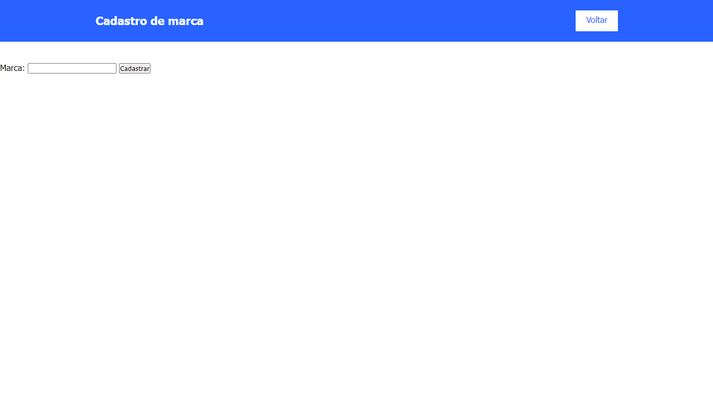
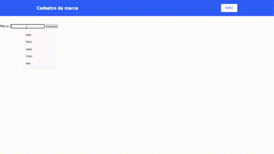

# Índice

[Projeto - Cadastros de ecommerce documentados](#projeto---cadastros-de-ecommerce-documentados)

[Descrição](#descri%C3%A7%C3%A3o)

[Introdução](#introdu%C3%A7%C3%A3o)

[Funcionalidades](#funcionalidades)

[Autores](#autores)

# Projeto - Cadastros de ecommerce documentados

## Descrição

Uma página feita juntamente com o professor Leonardo, onde o usuário poderá cadastrar marcas e categorias.

## Introdução

Tela onde o usuário realizara o cadastro da marca e categorias.

O usuário preencherá o campo em branco e logo após apertará no botão Cadastrar.
Ele será enviado para uma página onde lhe será informado que a marca ou a categoria foi cadatrada.

## Funcionalidades

*Botão Cadastrar*: Botão que manda os dados inseridos no campo para um banco de dados.

## Autores

* [_Leonardo Rocha_](https://github.com/LeonardoRochaMarista)